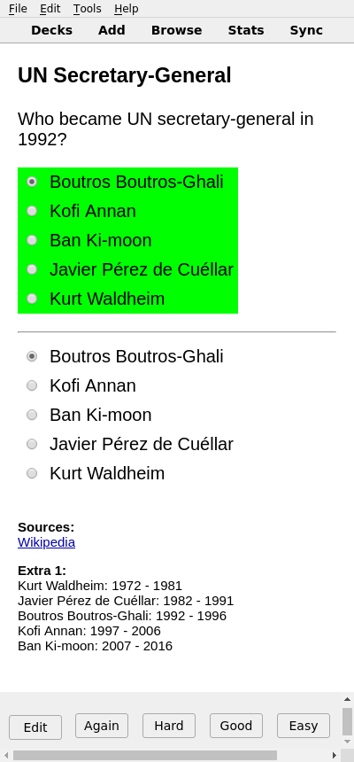
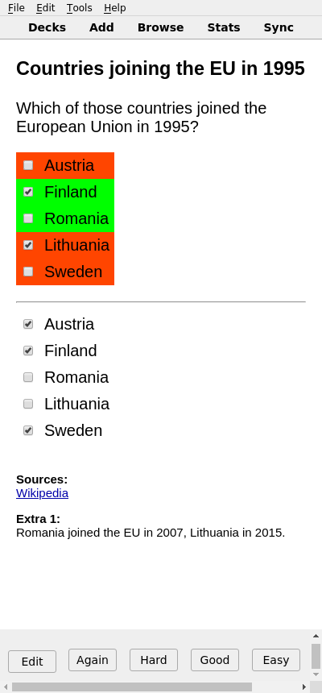

## anki-mc

Adds multiple choice cards to Anki.

### Screenshots

| Single Choice                                   | Multiple Choice                                     | Kprim                           |
|:-----------------------------------------------:|:---------------------------------------------------:|:-------------------------------:|
|  |  |  |

### Compatibility

Anki 2.1.20 or higher is required for this add-on to work.

Cards created with this add-on can be reviewed with all Computer and mobile apps and on AnkiWeb.

### Usage

#### Creating / Editing

The note type is automatically added the first time you start Anki after installing the add-on.

When creating cards, write a "1" for correct choices or a "0" for incorrect choices in the "Answers" field.
The question type can be selected with the field "QType".
It can be either 0 (Kprim), 1 (Multiple Choice) or 2 (Single Choice).
The [Screenshots](#screenshots) section shows how the question types look.
These values in the "Answer" field must be separated by a single space.
The order and number of values in the "Answer" field must correspond with the choices "Q_1" to "Q_5".
If you don't need all the choices, just leave the remaining "Q_" fields blank and only enter as many values as you need in the "Answers" field.

#### Reviewing

Select the correct and incorrect choices accordingly and click "Show Answer".
The add-on will automatically style your choices based on whether you answered correctly or not.

### License and Credits

*Multiple Choice for Anki* is *Copyright © 2021 [zjosua](https://github.com/zjosua)*

It is licensed under the AGPLv3.
For more information refer to the [LICENSE](https://github.com/zjosua/anki-mc/blob/master/LICENSE) file.

The files `__init__.py` and the template file are based on the Anki add-on [Cloze Overlapper](https://github.com/glutanimate/cloze-overlapper) by Glutanimate.
[Click here to support Glutanimate's work](https://glutanimate.com/support-my-work/).

Persistence is achieved using the code from [Simon Lammer's anki-persistence](https://github.com/SimonLammer/anki-persistence).
Great work Simon!

[Hax](https://github.com/Schlauer-Hax) merged my Multiple Choice card template with Simon Lammer's persistence code.
He also reworked my card templates into one single all-in-one template.
Thanks a lot!

Simon's and Hax's work made the multiple choice cards compatible with all platforms.

Volker Umpfenbach contributed a change that allows to customize how the questions and answers are colorized.
He also provided the code to calculate and display the percentage of correctly answered items per question.

Shoutout to [3ter](https://github.com/3ter) for his contributions that improve card initialization and checkbox handling.
