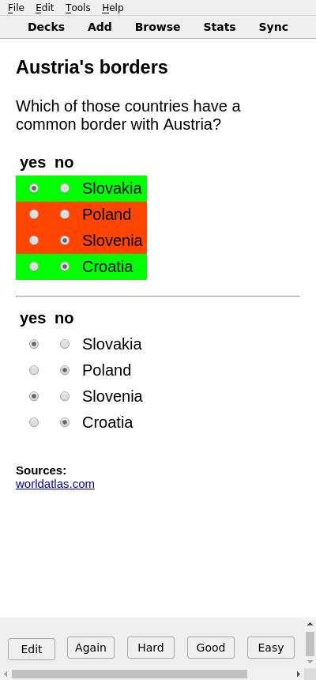
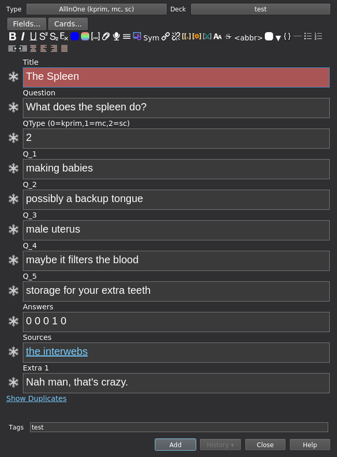

## anki-mc

Adds multiple choice cards to Anki.

### Screenshots

|  |  |  |
| ----------------------------------------------- | --------------------------------------------------- | ------------------------------ |

### Compatibility

Anki 2.1.20 or higher is required for this add-on to work.

Cards created with this add-on can be reviewed with all Computer and mobile apps and on AnkiWeb.

### Usage

#### Creating / Editing

The note type is automatically added the first time you start Anki after installing the add-on.

When creating cards, write a "1" for correct choices or a "0" for incorrect choices in the "Answers" field.
These values in the "Answer" field must be separated by a single space.
The order and number of values in the "Answer" field must correspond with the choices "MC_1" to "MC_5" (or "MC_4" for "Kprim" cards, respectively).
If you don't need all the choices, just leave the remaining "MC_" fields blank and only enter as many values as you need in the "Answers" field.

#### Reviewing

Select the correct and incorrect choices accordingly and click "Show Answer".
The add-on will automatically style your choices based on whether you answered correctly or not.

### License and Credits

*Multiple Choice for Anki* is *Copyright © 2020 [zjosua](https://github.com/zjosua)*

It is licensed under the AGPLv3.
For more information refer to the [LICENSE](https://github.com/zjosua/anki-mc/blob/master/LICENSE) file.

The files `__init__.py` and the template file are based on the Anki add-on [Cloze Overlapper](https://github.com/glutanimate/cloze-overlapper) by Glutanimate.
[Click here to support Glutanimate's work](https://glutanimate.com/support-my-work/).

Persistence is achieved using the code from [Simon Lammer's anki-persistence](https://github.com/SimonLammer/anki-persistence).
Great work Simon!

[Hax](https://github.com/Schlauer-Hax) merged my Multiple Choice card template with Simon Lammer's persistence code and thus made compatibility with all platforms possible.
Thanks a lot!
